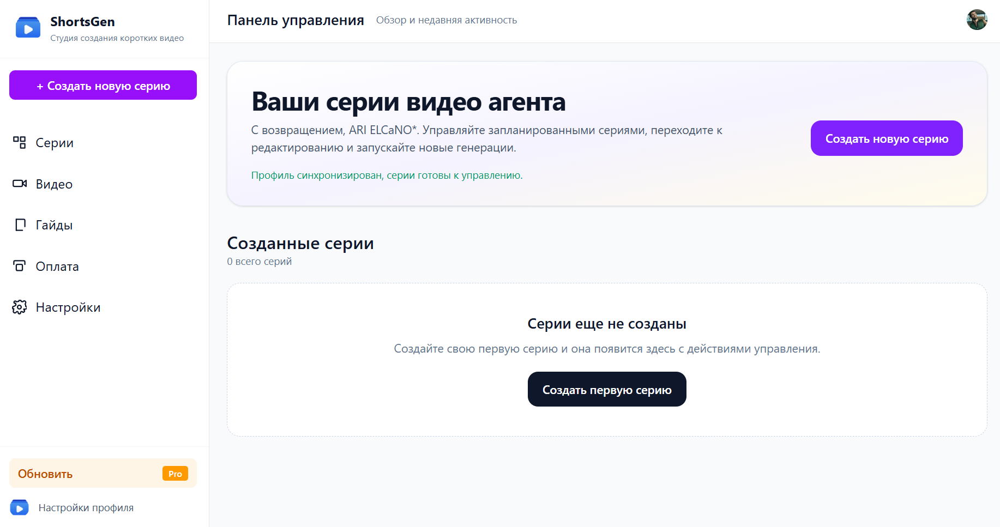
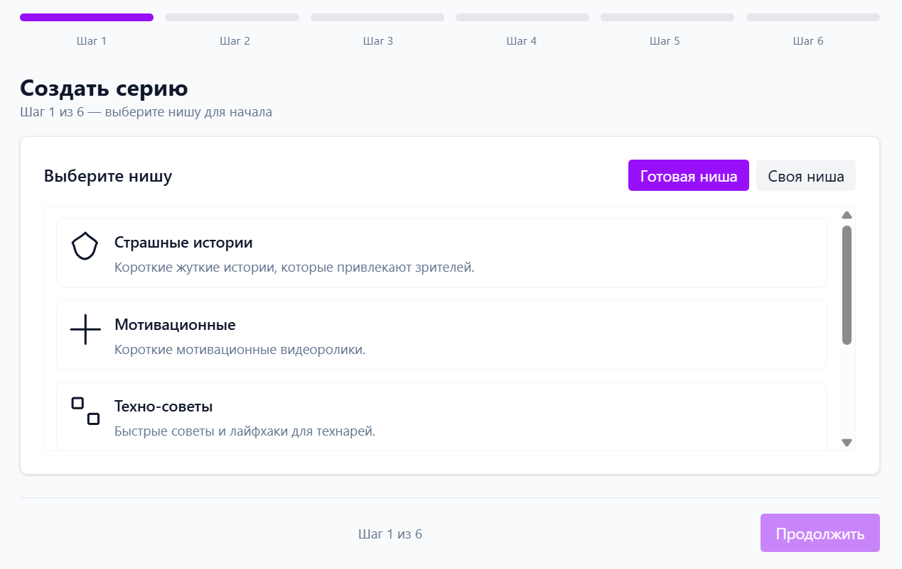
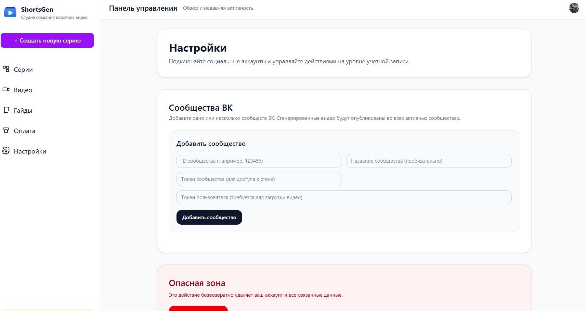
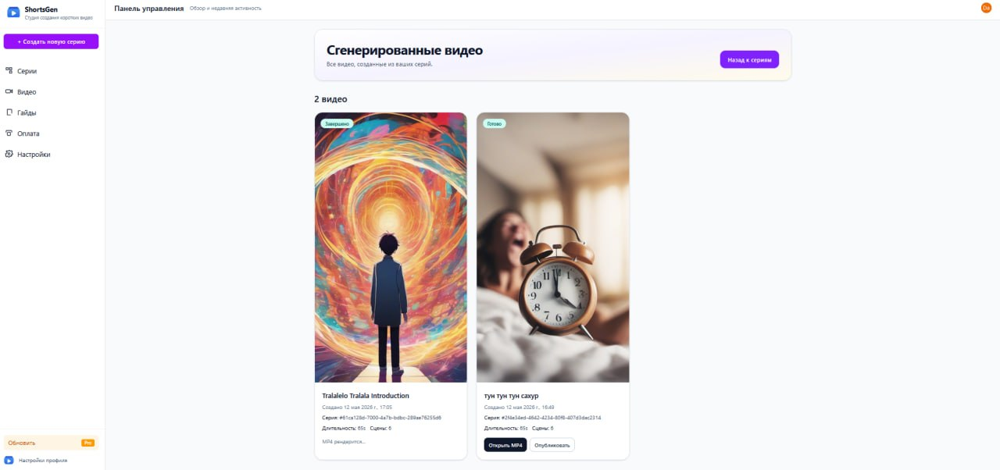
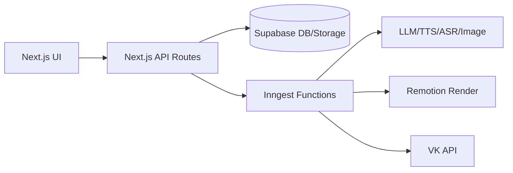

# 2026-6302-2-ai-video-agent
AI-агент для генерации коротких видео и публикации в VK сообщества (VK Video/VK Clips).

## Демо
- Деплой: http://viaduct.proxy.rlwy.net:55563

## Что делает продукт
- Создает видео по сценариям: текст, озвучка, изображения, субтитры, рендер.
- Хранит результаты в Supabase и показывает статус генерации.
- Публикует в VK сообщества вручную или по расписанию.
- Поддерживает несколько VK сообществ на одного пользователя.

## Скриншоты


_Скриншот 1 — Dashboard: статусы генерации, список серий и быстрые действия._


_Скриншот 2 — Create: настройка серии, сценария, расписания и параметров генерации._


_Скриншот 3 — Settings: подключение VK сообществ и управление токенами._


_Скриншот 4 — Videos: библиотека рендеров, предпросмотр и ручная публикация._


## Как это работает (коротко)
1. Пользователь настраивает серию и сохраняет.
2. Запускается пайплайн генерации (Inngest): сценарий → озвучка → субтитры → изображения → рендер MP4.
3. Результат сохраняется в Supabase (`videos`, `video_agent_series`).
4. Публикация:
   - вручную кнопкой `Опубликовать` в `Dashboard -> Videos`,
   - или автоматически по `publish_time` (cron Inngest).

## Архитектура


**Ключевые компоненты**
- Frontend: Next.js (App Router) + React + TypeScript.
- Backend: API Routes + Inngest фоновые задачи.
- Хранилище: Supabase (БД + Storage).
- Рендер: Remotion (MP4).
- Интеграция VK: `video.save` → upload → `wall.post`.

## Стек
- Next.js (App Router), React, TypeScript
- Supabase (DB + Storage)
- Inngest (фоновые пайплайны и cron)
- Remotion (рендер MP4)
- Clerk (auth)
- VK API

## Структура проекта (ключевые файлы)
- `app/api/videos/[id]/publish/route.ts` — ручная публикация в VK сообщества.
- `lib/inngest.ts` — генерация видео + автопубликация по расписанию.
- `lib/social/vk.ts` — VK API интеграция: `video.save`, upload, `wall.post`.
- `app/dashboard/settings/page.tsx` — управление VK сообществами и токенами.
- `app/dashboard/videos/videos-client.tsx` — UI для ручной публикации.
- `app/api/social/connections/*` — CRUD настроек VK сообществ.
- `supabase/migrations/*` — схемы БД и миграции.

## Быстрый старт
### Вариант 1: Docker Compose (рекомендуется)
1. Скопируйте переменные окружения:
```bash
cp .env.example .env.local
```
2. Заполните `.env.local` (Clerk, Supabase, VK, AI ключи).
3. Поднимите стек:
```bash
docker compose up --build
```
4. Откройте:
- App: `http://localhost:3000`
- Inngest UI: `http://localhost:8288`

Если есть `ECONNREFUSED`/`Failed to register` для Inngest:
- проверьте, что сервис `inngest` запущен;
- перезапустите `docker compose down` и затем `docker compose up --build`;
- убедитесь, что заданы `INNGEST_DEV` и `INNGEST_BASE_URL=http://inngest:8288`.

### Вариант 2: Локально без Docker
```bash
npm install
npm run dev
npx inngest-cli@latest dev
```

## Настройка публикации в VK сообщества
В `Settings` добавьте сообщество через `Add community` и заполните:
- `Community ID` — ID сообщества (число, без `club`/`public`).
- `Community name` — опционально.
- `Community token (for wall access)` — токен сообщества.
- `User access token (required for video upload)` — пользовательский токен администратора сообщества.

**Почему нужны два токена:**
- `User access token` используется для `video.save` и загрузки видео.
- `Community token` используется для публикации поста от имени сообщества (`wall.post`, `from_group=1`).

## Публикация по расписанию
1. У серии должен быть установлен `publish_time`.
2. Видео должно иметь статус `rendered` и `video_url`.
3. Cron Inngest проверяет серии и публикует в VK, затем выставляет `published_at`.

## Участники и вклад
Вклад распределен примерно равномерно, при этом чуть больший вклад:
- **Роман Хафизов** — основная логика пайплайнов генерации, интеграция VK, суппорт прод-потока.
- **Илья Халитов** — архитектура, интеграции и UI, оркестрация процессов.
- **Рафаэль Бурганов** — фронтенд и UX, экран настроек и управление сообществами.
- **Станислав Мрясов** — инфраструктура, миграции, тестирование и стабилизация.
- **Кирилл Кудряшов** — UI, сборка и качество пользовательского потока.

---
